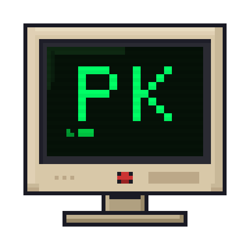
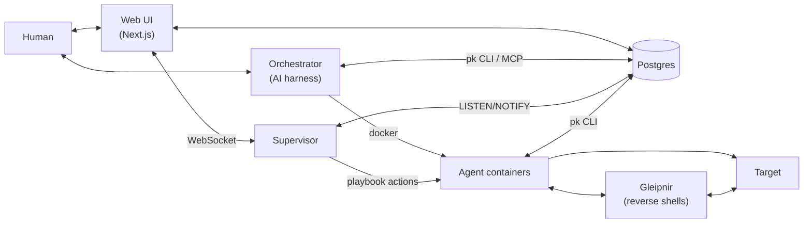

<p align="center">
  
</p>

<h1 align="center">PromptKiddie</h1>

<p align="center">
  <em>LLM Powered Automated Hacking Playbooks.</em>
</p>

<p align="center">
  An autonomous supervisor that scans, enumerates, and escalates while you steer.<br>
  You set the scope; PK handles the methodology, evidence, and reporting.
</p>

<p align="center">
    You can work from the web interface, directly in your favorite harness, or the CLI if you're that kind of kiddo. Script your own playbooks with the provided SDK.
</p>

---

**Key features:**

- **Event-driven playbooks.** Write playbooks that react to events, trigger an automated portscan on engagement start, and act on the findings programmatically or delegate to an agent.
- **Judgment stays with the LLM, mechanics don't.** Port scanning, fingerprinting,
  and directory brute-forcing are scripted actions. The LLM only gets called for
  decisions that need reasoning: exploit selection, source code analysis, privesc
  path planning.
- **Everything in a database.** Targets, ports, services, findings, evidence,
  credentials, flags, activity log. Nothing lives only in chat history. Reports
  generate from DB state, not from some LLM memory.
- **Multi-harness.** Works with any harness; Claude Code, Codex, OpenCode, Pi.dev, or the built-in web
  chat via Vercel AI SDK.

## Quick start

```bash
npx @promptkiddie/init
```

**Host mode** runs your AI agent locally (Claude Code, Codex, etc.) with PK services in Docker.
**Hosted mode** runs everything in Docker with a web UI and SSH access.

Open your agent or the web chat and tell it:

> Add 127.0.0.1:3000 as a CTF engagement named "OWASP Juice Shop" then start it

View progress at `localhost:3100`.

## Architecture



## Engagement types

| Type | Use case |
|------|----------|
| `ctf` | Hack The Box, TryHackMe, Proving Grounds. Flag tracking + auto-phase. |
| `blackbox` | Authorized pentest, no prior knowledge. Phase-gated methodology. |
| `whitebox` | Source access, architecture docs. Deeper analysis actions. |
| `bugbounty` | Scoped bug bounty. Respects rate limits and exclusions. |

## Knowledge base

PK ships exploits and techniques as structured knowledge in [OKF](packages/core/src/knowledge/SPEC.md) format. The supervisor auto-matches discovered versions against the exploit index and fires when it finds a hit. Sources include HackTricks and GTFOBins.

## Documentation

- [Getting started: host mode](docs/getting-started-host.md) - AI agent runs locally, infra in Docker
- [Getting started: hosted mode](docs/getting-started-hosted.md) - everything in Docker, web UI + SSH
- [Methodology](docs/METHODOLOGY.md) - phased process and rules of engagement
- [Architecture](docs/ARCHITECTURE.md) - how the pieces fit together
- [AGENTS.md](AGENTS.md) - repo structure, package scopes, build and contribution guide

## Safety

For authorized testing, CTFs, and education only. Every engagement requires a
Rules-of-Engagement record with scope, allowed actions, and time windows. The
orchestrator refuses to act outside defined scope.

LLMs with access to live machines and networks can be quite dangerous. Use at your own risk.
