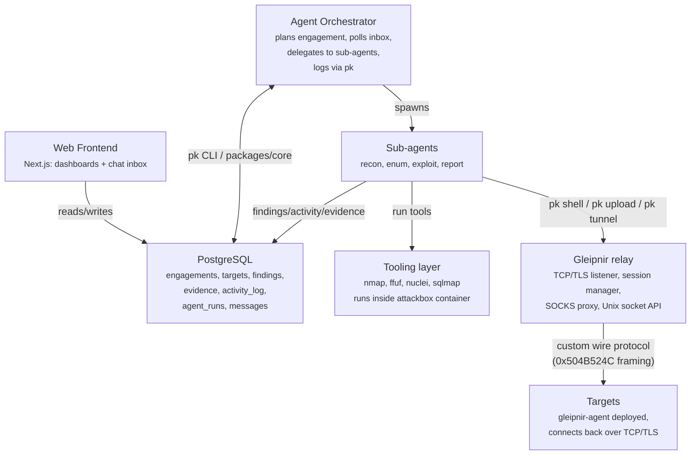

# Architecture

PromptKiddie has three layers: an **orchestration** layer (AI agent), a **persistence**
layer (PostgreSQL), and a **tooling** layer (offensive tools, eventually behind an MCP).
A web frontend sits on top of persistence for human control.

## Orchestration layer

The **main session is the Orchestrator**. It does not do the grunt work itself; it:

1. Loads the active engagement and its Rules of Engagement (RoE).
2. Decides which methodology phase to run next (see `METHODOLOGY.md`).
3. Delegates a scoped task to a **sub-agent** (recon/enum/exploit/report), or when a
   sub-agent would be overkill, runs a single tool directly via Bash and logs it.
4. Persists results through the `pk` CLI / `packages/core` API.
5. Polls the `messages` inbox for human input and replies there, so the whole thing can run
   in the background while you drive from the frontend.

### Skills are primary; sub-agents are optional

**Skills** (`.claude/skills/`) are the heart of the workspace: the reusable, opinionated
*playbooks* for how to run recon, enumerate, exploit, capture evidence, and report. They
carry the methodology and are injected into whichever context needs them.

**Sub-agents** (`.claude/agents/`) are thin wrappers, not where the value lives. A sub-agent
exists only to give the orchestrator **context isolation** (a huge scan dump doesn't flood
the main session) and **parallelism**. Each one essentially says "follow skill X for this
phase and report back." When isolation isn't needed, the orchestrator runs the phase itself
using the skill directly, no sub-agent required.

### Why an inbox instead of `-p`

The orchestrator runs as a normal interactive AI agent session. To let a human steer a
backgrounded session, control flows through the `messages` table:

- The frontend (or `pk msg send`) inserts an `inbound` row.
- The orchestrator polls (`pk msg poll`) for `new` inbound messages, acts, and writes an
  `outbound` reply.
- Everything is durable and auditable. The conversation is part of the engagement record.

A Postgres `LISTEN/NOTIFY` channel can replace polling later for lower latency.

## Persistence layer (PostgreSQL + Drizzle)

A single Postgres database is the source of truth for an engagement. Schema lives in
`packages/core/src/schema.ts` (Drizzle ORM, `node-postgres` driver). Core entities:

| Table          | Purpose                                                                 |
| -------------- | ----------------------------------------------------------------------- |
| `engagements`  | One per CTF/assessment/program. Holds type, status, scope, RoE.         |
| `targets`      | Hosts/domains/URLs/apps/repos within an engagement, with in-scope flag. |
| `findings`     | Vulnerabilities/flags with severity, CVSS, OWASP/ATT&CK/CVE mappings.   |
| `evidence`     | Files/screenshots/scan output, hashed (sha256) and linked to findings.  |
| `activity_log` | Append-only audit trail: every command/action the orchestrator takes.   |
| `agent_runs`   | One row per sub-agent invocation: agent, phase, status, summary.         |
| `messages`     | Bidirectional human↔orchestrator inbox driving background operation.    |

Disk artifacts (raw scan output, screenshots, downloaded files) live under
`engagements/<slug>/` and are referenced by path + hash from the `evidence` table. Engagement
data is **gitignored**. Never commit client/target data.

### Two ways to write the DB: CLI now, MCP next

All persistence goes through one core library (`packages/core`). Two front-ends sit on top:

- **`pk` CLI** (`packages/cli`): shell commands the orchestrator/sub-agents run today.
  Easy to script, human-friendly.
- **Logging MCP server** (planned): wraps the *same* core functions as structured MCP
  tools (`add_finding`, `log_activity`, …) for type-safe, tool-native logging.

Because both call the same core, behavior stays identical no matter which is used.

## Tooling layer

Offensive tools (nmap, ffuf, nuclei, sqlmap, etc.) run inside the **attackbox** Docker
container. The orchestrator and sub-agents invoke them via `pk exec`, which auto-logs
commands and output to the engagement activity trail.

A **tooling MCP server** (`packages/tooling-mcp`) exposes the same tools as structured MCP
tools for type-safe invocation.

## Gleipnir (reverse shell handler)

Gleipnir is PK's persistent reverse shell handler. It replaces ad-hoc netcat/chisel setups
with a structured C2 channel.

**Relay** (`packages/gleipnir/relay`): runs as a Docker service sharing the attackbox
network (and VPN tunnel). Listens for agent callbacks on TCP with TLS enabled by default
(auto-generates a self-signed cert if none provided). Exposes a Unix socket API
(`/tmp/gleipnir.sock`) for the CLI and MCP server to send commands.

**Agent** (`packages/gleipnir/agent`): a single static Rust binary cross-compiled per
target (linux-amd64, linux-arm64, windows-amd64; slim and TLS variants). Deployed to
targets via file upload. Connects back to the relay, auto-reconnects with exponential
backoff, and resumes the same session across reboots via a persistent session ID.

**Wire protocol**: custom binary framing (`0x504B524C` magic), not HTTP or protobuf.
Frame types: CMD, CMD_OUTPUT, FILE_UP, FILE_DOWN, SOCKS_OPEN/DATA/CLOSE, PING/PONG, INFO.
No recognizable protocol signatures for DPI.

**Key features**:
- Named sessions with platform detection (OS, arch, user, hostname)
- Command execution with timeout and process cleanup
- Chunked binary file transfer (upload and download)
- Built-in SOCKS5 proxy (replaces chisel for pivoting)
- KotH persistence: cron (Linux), schtasks/registry (Windows), process masquerade,
  hidden install, self-delete, multi-host callback fallback

**Integration**: `pk shell`/`pk upload`/`pk download`/`pk tunnel` CLI commands and
`gleipnir_exec`/`gleipnir_upload`/`gleipnir_download`/`gleipnir_sessions`/`gleipnir_tunnel`
MCP tools. Pre-compiled agent binaries are fetched from GitHub releases into the attackbox
at `/opt/gleipnir/agents/`.

## Frameworks

Findings are tagged against shared frameworks so reports are standard and comparable:

- **MITRE ATT&CK**: technique IDs (e.g. `T1190`) on findings/activity.
- **OWASP**: Top 10 / WSTG / ASVS references for web findings.
- **CVE + CVSS**: known-vuln identifiers and severity scoring.

See `docs/frameworks/` for cheat-sheets and the canonical mappings.
